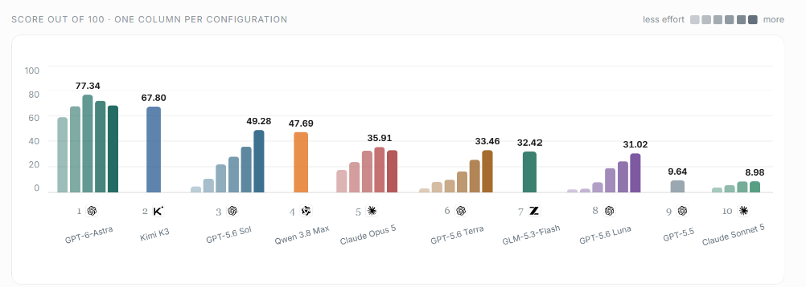

# PPTBench

**Can Coding Agents Reconstruct the Visual World through Structured, Editable Slides?**

[Paper](https://arxiv.org/abs/2609.29718) · [Website](https://lab.einsia.ai/pptbench/) · [Leaderboard](https://lab.einsia.ai/pptbench/leaderboard/)

PPTBench asks whether a coding agent can recover the structure of a scientific diagram and
reconstruct it as a single PowerPoint slide made of native, editable objects. Its 500 tasks
come from real arXiv papers: the agent sees a reference image and approved raster resources,
then writes the text, shapes, connectors, and layout needed to reproduce it.

A valid file is only the first step. The evaluation checks process semantics and rendering
before scoring the remaining visual differences with fixed, executable rules.

## Results



The benchmark covers **36 configurations across 10 model families**, with 500 tasks per
configuration and three independent judge rounds per task. GPT-6 Astra with Codex at High
scores **77.34/100**, clears the hard gates on **80.8%** of tasks, and produces valid artifacts
on all 500 tasks. More reasoning is not uniformly better: its XHigh and Max configurations
score 72.60 and 68.76.

| GPT-6 Astra / Codex effort | Score / 100 | Gates passed | Valid artifacts |
| --- | ---: | ---: | ---: |
| Low | 59.42 | 63.0% | 488 / 500 |
| Medium | 68.16 | 71.6% | 497 / 500 |
| High | 77.34 | 80.8% | 500 / 500 |
| XHigh | 72.60 | 74.8% | 478 / 500 |
| Max | 68.76 | 71.0% | 466 / 500 |

The complete [leaderboard](results/leaderboard.csv), [18,000 per-task scores](results/scores.csv),
[merged findings](results/case-results.jsonl), [issue summary](results/issue-summary.csv),
[bootstrap analysis](results/bootstrap.json), and [generation metrics](results/generation-metrics.csv)
are available in `results/`.

## Quickstart

PPTBench targets **Linux or WSL2**, Python 3.10+, Bubblewrap, and LibreOffice. Official candidate
rendering uses LibreOffice 25.8; other versions are suitable for a local installation smoke,
but their output is not an official comparable measurement. Install and authenticate a native
[Codex CLI](https://developers.openai.com/codex/cli/) before running an agent.

```bash
git clone https://github.com/Einsia/PPTBench.git
cd PPTBench
sudo apt-get update
sudo apt-get install -y python3-venv bubblewrap libreoffice-impress
python3 -m venv .venv
. .venv/bin/activate
python -m pip install -e .
python scripts/release/verify_release.py
```

The checkout contains source addresses, hashes, rendering recipes, and resource indexes;
paper PDFs and figure pixels are downloaded locally. Review [DATA_LICENSE.md](DATA_LICENSE.md),
the [arXiv API terms](https://info.arxiv.org/help/api/tou.html), and
[reuse guidance](https://info.arxiv.org/help/license/reuse.html) before materializing them.

Download and verify all 500 frozen tasks:

```bash
pptbench-materialize \
  --task-file configs/taskset.txt \
  --output-root data/pptbench-tasks \
  --accept-arxiv-terms --resume
```

This verifies the exact source PDF bytes, reference pixels, and all approved resource pixels.
Downloads are cached and paced; rerunning with `--resume` verifies and reuses completed tasks.
Use `--offline --resume` to verify the completed tree without network access, or `--replace`
to rebuild a damaged task. Do not substitute a newer paper version or a different figure.

Run one real reconstruction with the same harness used by the benchmark:

```bash
pptbench-eval --config project.toml harness-run \
  --harness single-run --agent codex \
  --model gpt-6-astra --reasoning-effort low \
  --sample task_0004 --timeout 0
```

The harness uses the caller's Codex authentication and provider configuration, gives the agent
an isolated image-only workspace, and validates and renders `reconstruction.pptx`. It retains
the original response, artifact, and validation evidence under `results/local/`. `--timeout 0`
disables the agent time limit. See [the reconstruction guide](docs/generation-harness.md) for
setup, selective task materialization, batch runs, and troubleshooting.

## Evaluation

Each task follows four stages:

| Stage | What is checked | Effect |
| --- | --- | --- |
| Artifact validity | Readable, single-slide PPTX; native objects; approved raster use; successful rendering | A model artifact failure scores zero |
| Process semantics | Nodes, connector attachment, direction, and flow meaning | A majority failure scores zero |
| Rendering | Widespread rendering and text failures | A majority failure scores zero |
| Visual detail | Layout and composition (30), text and typography (40), local graphics and nodes (30) | Fixed penalties determine the score |

GPT-5.6 Luna High performs three independent judge rounds for each task. The judge reports
findings rather than assigning points. Semantic or rendering failures in at least two rounds
make the merged score zero. Otherwise, findings from non-gated rounds are merged by dimension,
category, and issue type, retaining the largest affected fraction; Python applies the frozen
severity and ratio rules. Failed model artifacts remain in the 500-task denominator.

Run one judge round:

```bash
pptbench-vlm-judge \
  --tasks configs/taskset.txt --dataset-root data/pptbench-tasks \
  --semantic-gate-prompt configs/vlm_judge/semantic_gate.txt \
  --render-gate-prompt configs/vlm_judge/render_gate.txt \
  --score-prompt configs/vlm_judge/detail_findings.txt \
  --candidate candidate=/path/to/rollout-summary.json \
  --judge luna-high=gpt-5.6-luna:high \
  --output-dir results/local/judge-round-1
```

Rank each round with `pptbench-vlm-rank`, then merge three rounds with
`pptbench-vlm-consensus-rank`. The [evaluation guide](docs/evaluation.md) explains the
commands and the [frozen prompts](configs/vlm_judge/) define the executable protocol.

## Tasks and documentation

- [Frozen task identifiers](configs/taskset.txt) and [materialization manifest](benchmark/materialization_manifest.jsonl)
- [Task provenance and approved resource indexes](benchmark/tasks/)
- [Source license audit](SOURCE_LICENSE_AUDIT.md)
- [Reconstruction harness](docs/generation-harness.md)
- [Judging and scoring](docs/evaluation.md)
- [Collection and curation](docs/data-collection.md)
- [Architecture](docs/architecture.md) and [maintainer tools](docs/maintenance.md)

Materialized sources and generated runs stay in Git-ignored directories. Credentials belong
in the local environment or CLI authentication store, never in task metadata or result tables.

## License

Code is released under the [MIT License](LICENSE). PPTBench-authored metadata, annotations,
and judge findings are released under CC BY 4.0. Scientific figures retain the licenses and
copyrights of their source papers; see [DATA_LICENSE.md](DATA_LICENSE.md).

## Citation

```bibtex
@article{wang2026pptbench,
  title   = {PPTBench: Can Coding Agents Reconstruct the Visual World through Structured, Editable Slides},
  author  = {Xiaoqiu Wang and Yizhe Chi and Wenyi Li and Deyao Hong and Zhihan Shan and Mingju Gao and Kaisen Yang and Youjie Zheng and Calvin Xiao and Qinhuai Na},
  journal = {arXiv preprint arXiv:2609.29718},
  year    = {2026},
  url     = {https://arxiv.org/abs/2609.29718}
}
```
